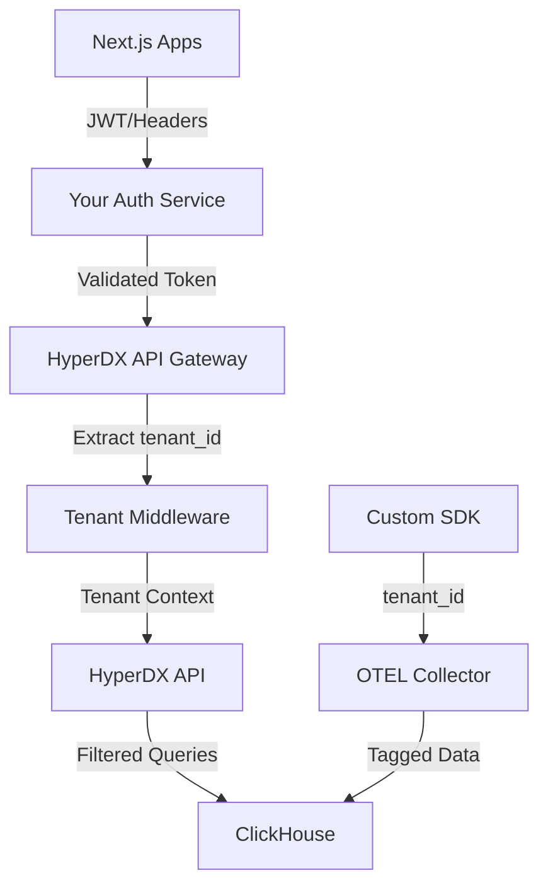

# Multi-Tenant HyperDX Architecture Design

## Executive Summary

This design document outlines a comprehensive multi-tenant architecture for HyperDX observability platform, integrating with your existing auth/authorization services while maintaining data isolation and performance. The solution retrofits HyperDX's OSS version with tenant-aware data handling across the entire stack - from ingestion to visualization.

## Current HyperDX Architecture Analysis

### Existing Components
- **Frontend**: Next.js React app (`packages/app`)
- **Backend API**: Express.js with MongoDB metadata storage (`packages/api`)  
- **Data Storage**: ClickHouse for logs/metrics/traces
- **Ingestion**: OpenTelemetry Collector (OTEL)
- **Team Model**: Basic single-tenant team structure exists

### Key Insights from Code Analysis
- HyperDX already has a `Team` model with `apiKey` and `hookId` fields
- ClickHouse schema is extensible via migrations (SQL files in `migrations/ch/`)
- API uses modular Express.js structure with middleware support
- Configuration supports flexible environment-based setup

## Multi-Tenant Architecture Design

### 1. Tenant Isolation Strategy

#### A. Row-Level Security (Recommended)
```sql
-- Add tenant_id to all ClickHouse tables
ALTER TABLE default.logs ADD COLUMN tenant_id String CODEC(ZSTD(1));
ALTER TABLE default.traces ADD COLUMN tenant_id String CODEC(ZSTD(1)); 
ALTER TABLE default.metric_stream ADD COLUMN tenant_id String CODEC(ZSTD(1));

-- Create tenant-aware indexes
CREATE INDEX logs_tenant_idx ON default.logs (tenant_id) TYPE bloom_filter(0.01) GRANULARITY 1;
```

#### B. Alternative: Database-Per-Tenant
```sql
-- Dynamic database creation for strong isolation
CREATE DATABASE tenant_${tenant_id};
-- Route data during ingestion based on tenant context
```

### 2. Authentication Integration Architecture



### 3. Data Flow with Tenant Tagging

#### Ingestion Pipeline
```yaml
# Enhanced OTEL Collector Config
receivers:
  otlp:
    protocols:
      grpc:
        endpoint: 0.0.0.0:4317
      http:
        endpoint: 0.0.0.0:4318

processors:
  # Custom tenant tagger processor
  tenant_tagger:
    # Extract tenant_id from headers or auth context
    tenant_header: "x-tenant-id"
    fallback_tenant: "default"
  
  # Existing processors
  attributes:
    actions:
      - key: tenant_id
        from_attribute: tenant.id
        action: insert
  batch:

exporters:
  clickhouse:
    endpoint: tcp://clickhouse:9000
    database: default
    # Ensure tenant_id is included in all exports

service:
  pipelines:
    logs:
      receivers: [otlp]
      processors: [tenant_tagger, attributes, batch]
      exporters: [clickhouse]
```

### 4. API Layer Modifications

#### Tenant-Aware Middleware
```typescript
// packages/api/src/middleware/tenant.ts
import { Request, Response, NextFunction } from 'express';
import { extractTenantFromAuth } from '@/utils/auth';

export interface TenantRequest extends Request {
  tenant?: {
    id: string;
    name: string;
  };
}

export const tenantMiddleware = async (
  req: TenantRequest,
  res: Response,
  next: NextFunction
) => {
  try {
    // Extract tenant from your auth service
    const authToken = req.headers.authorization;
    const tenant = await extractTenantFromAuth(authToken);
    
    if (!tenant) {
      return res.status(403).json({ error: 'Invalid tenant context' });
    }
    
    req.tenant = tenant;
    next();
  } catch (error) {
    res.status(401).json({ error: 'Authentication failed' });
  }
};
```

#### Query Filtering System
```typescript
// packages/api/src/utils/clickhouse-tenant.ts
import { ch } from '@/clickhouse';

export class TenantAwareClickHouse {
  constructor(private tenantId: string) {}

  async query(sql: string, params: any[] = []) {
    // Automatically inject tenant filter into all queries
    const tenantFilteredSql = this.injectTenantFilter(sql);
    return ch.query({
      query: tenantFilteredSql,
      query_params: { tenant_id: this.tenantId, ...params }
    });
  }

  private injectTenantFilter(sql: string): string {
    // SQL parsing logic to add WHERE tenant_id = {tenant_id:String}
    // Handle various SQL patterns (SELECT, INSERT, etc.)
    if (sql.includes('WHERE')) {
      return sql.replace(/WHERE/, 'WHERE tenant_id = {tenant_id:String} AND');
    }
    // Add WHERE clause if none exists
    const selectMatch = sql.match(/FROM\s+(\w+)/i);
    if (selectMatch) {
      return sql.replace(selectMatch[0], `${selectMatch[0]} WHERE tenant_id = {tenant_id:String}`);
    }
    return sql;
  }
}
```

### 5. Frontend Tenant Context

#### Tenant-Aware React Context
```typescript
// packages/app/src/contexts/TenantContext.tsx
import { createContext, useContext, useEffect, useState } from 'react';
import { fetchTenantInfo } from '@/api/tenant';

interface TenantContextType {
  tenant: { id: string; name: string } | null;
  loading: boolean;
  switchTenant: (tenantId: string) => Promise<void>;
}

const TenantContext = createContext<TenantContextType | null>(null);

export const TenantProvider = ({ children }: { children: React.ReactNode }) => {
  const [tenant, setTenant] = useState<{ id: string; name: string } | null>(null);
  const [loading, setLoading] = useState(true);

  useEffect(() => {
    // Extract tenant from auth service or JWT
    fetchTenantInfo().then(setTenant).finally(() => setLoading(false));
  }, []);

  const switchTenant = async (tenantId: string) => {
    // Implement tenant switching logic
    setLoading(true);
    const newTenant = await fetchTenantInfo(tenantId);
    setTenant(newTenant);
    setLoading(false);
  };

  return (
    <TenantContext.Provider value={{ tenant, loading, switchTenant }}>
      {children}
    </TenantContext.Provider>
  );
};

export const useTenant = () => {
  const context = useContext(TenantContext);
  if (!context) throw new Error('useTenant must be used within TenantProvider');
  return context;
};
```

### 6. Custom SDK Design for Next.js Integration

#### Multi-Tenant SDK Architecture
```typescript
// @yourorg/hyperdx-sdk/src/index.ts
import { NodeSDK } from '@opentelemetry/sdk-node';
import { OTLPLogExporter } from '@opentelemetry/exporter-logs-otlp-http';
import { Resource } from '@opentelemetry/resources';
import { SemanticResourceAttributes } from '@opentelemetry/semantic-conventions';

export interface SDKConfig {
  serviceName: string;
  hyperdxEndpoint: string;
  authServiceEndpoint: string;
  environment?: string;
}

export interface LogOptions {
  level?: 'DEBUG' | 'INFO' | 'WARN' | 'ERROR';
  attributes?: Record<string, any>;
  tenantId?: string;
}

export class MultiTenantHyperDXSDK {
  private sdk: NodeSDK;
  private config: SDKConfig;

  constructor(config: SDKConfig) {
    this.config = config;
    this.initializeSDK();
  }

  private initializeSDK() {
    const resource = new Resource({
      [SemanticResourceAttributes.SERVICE_NAME]: this.config.serviceName,
      [SemanticResourceAttributes.SERVICE_VERSION]: process.env.npm_package_version,
      [SemanticResourceAttributes.DEPLOYMENT_ENVIRONMENT]: this.config.environment || 'production'
    });

    this.sdk = new NodeSDK({
      resource,
      logRecordProcessor: new BatchLogRecordProcessor(
        new OTLPLogExporter({
          url: `${this.config.hyperdxEndpoint}/v1/logs`,
          headers: {
            'User-Agent': '@yourorg/hyperdx-sdk'
          }
        })
      )
    });

    this.sdk.start();
  }

  async log(message: string, options: LogOptions = {}, request?: any) {
    const tenantId = options.tenantId || await this.extractTenantId(request);
    
    const logRecord = {
      body: message,
      timestamp: Date.now() * 1000000, // nanoseconds
      attributes: {
        tenant_id: tenantId,
        level: options.level || 'INFO',
        service_name: this.config.serviceName,
        ...options.attributes
      }
    };

    // Send to OTEL collector with tenant context
    this.sendLogRecord(logRecord);
  }

  private async extractTenantId(request?: any): Promise<string> {
    if (!request) return 'default';

    // Extract from Next.js request headers
    const authHeader = request.headers?.authorization;
    if (authHeader) {
      try {
        const response = await fetch(`${this.config.authServiceEndpoint}/validate`, {
          headers: { Authorization: authHeader }
        });
        const auth = await response.json();
        return auth.tenant_id;
      } catch (error) {
        console.error('Failed to extract tenant ID:', error);
        return 'default';
      }
    }

    return 'default';
  }

  // Next.js specific helpers
  withNextJSLogging() {
    return {
      middleware: this.createNextJSMiddleware.bind(this),
      apiHandler: this.createAPIHandler.bind(this),
      errorBoundary: this.createErrorBoundary.bind(this)
    };
  }

  private createNextJSMiddleware() {
    return async (request: NextRequest) => {
      await this.log('Request started', {
        attributes: {
          path: request.nextUrl.pathname,
          method: request.method,
          user_agent: request.headers.get('user-agent')
        }
      }, request);

      return NextResponse.next();
    };
  }

  async shutdown() {
    return this.sdk.shutdown();
  }
}

// Usage in Next.js app
// app/lib/hyperdx.ts
import { MultiTenantHyperDXSDK } from '@yourorg/hyperdx-sdk';

export const hyperdx = new MultiTenantHyperDXSDK({
  serviceName: 'my-nextjs-app',
  hyperdxEndpoint: process.env.HYPERDX_ENDPOINT!,
  authServiceEndpoint: process.env.AUTH_SERVICE_ENDPOINT!,
  environment: process.env.NODE_ENV
});

// middleware.ts
import { hyperdx } from '@/lib/hyperdx';

export const middleware = hyperdx.withNextJSLogging().middleware;
```

### 7. Database Schema Migrations

#### ClickHouse Schema Updates
```sql
-- 000002_add_tenant_support.up.sql
-- Add tenant_id to all observability tables
ALTER TABLE default.logs ADD COLUMN IF NOT EXISTS tenant_id String DEFAULT '' CODEC(ZSTD(1));
ALTER TABLE default.traces ADD COLUMN IF NOT EXISTS tenant_id String DEFAULT '' CODEC(ZSTD(1));
ALTER TABLE default.metric_stream ADD COLUMN IF NOT EXISTS tenant_id String DEFAULT '' CODEC(ZSTD(1));

-- Create optimized indexes for tenant filtering
ALTER TABLE default.logs ADD INDEX IF NOT EXISTS idx_tenant_timestamp (tenant_id, timestamp) TYPE minmax GRANULARITY 1;
ALTER TABLE default.traces ADD INDEX IF NOT EXISTS idx_tenant_timestamp (tenant_id, timestamp) TYPE minmax GRANULARITY 1;
ALTER TABLE default.metric_stream ADD INDEX IF NOT EXISTS idx_tenant_timestamp (tenant_id, timestamp) TYPE minmax GRANULARITY 1;

-- Create tenant isolation views (optional for additional security)
CREATE VIEW IF NOT EXISTS tenant_logs AS
SELECT * FROM default.logs 
WHERE tenant_id = getSetting('tenant_id', '');
```

#### MongoDB Schema Updates
```typescript
// Enhanced Team model
export type ITeam = {
  _id: ObjectId;
  name: string;
  tenantId: string; // New field for external tenant mapping
  allowedAuthMethods?: 'password'[];
  apiKey: string;
  hookId: string;
  collectorAuthenticationEnforced: boolean;
  // Tenant-specific settings
  settings?: {
    dataRetentionDays?: number;
    maxUsersPerTenant?: number;
    allowedIngestionRate?: number; // logs per minute
  };
} & TeamCHSettings;
```

### 8. Implementation Phases

#### Phase 1: Core Infrastructure (2-3 weeks)
1. **Database Schema Updates**
   - ClickHouse migrations for tenant_id columns
   - Index creation for optimized tenant filtering
   - MongoDB Team model enhancements

2. **Authentication Integration**
   - Tenant middleware development
   - Auth service integration points
   - JWT validation and tenant extraction

#### Phase 2: API Layer Modifications (2-3 weeks)
3. **Query Filter System**
   - Tenant-aware ClickHouse client wrapper
   - Automatic query filtering injection
   - API endpoint modifications

4. **Security & Validation**
   - Tenant access controls
   - Data leak prevention measures
   - Query performance optimization

#### Phase 3: Ingestion Pipeline (2 weeks)
5. **OTEL Collector Enhancement**
   - Custom tenant tagging processor
   - Header-based tenant extraction
   - Ingestion rate limiting per tenant

6. **SDK Development**
   - Core multi-tenant SDK
   - Next.js specific integrations
   - Error handling and fallbacks

#### Phase 4: Frontend & UX (1-2 weeks)
7. **Tenant-Aware UI**
   - Tenant context provider
   - Dashboard filtering
   - Tenant switching (if required)

8. **Testing & Validation**
   - End-to-end tenant isolation testing
   - Performance benchmarking
   - Security audit

## Performance Considerations

### ClickHouse Optimization
- **Tenant Indexing**: Partition by `tenant_id` for large deployments
- **Query Optimization**: Ensure tenant filters are applied early in query execution
- **Resource Allocation**: Monitor per-tenant resource usage

### Scaling Strategy
```yaml
# Kubernetes deployment with tenant affinity
apiVersion: apps/v1
kind: Deployment
metadata:
  name: hyperdx-api
spec:
  replicas: 3
  template:
    spec:
      containers:
      - name: api
        env:
        - name: TENANT_AWARE_MODE
          value: "true"
        resources:
          requests:
            memory: "512Mi"
            cpu: "250m"
          limits:
            memory: "1Gi" 
            cpu: "500m"
```

## Security Architecture

### Data Isolation Guarantees
1. **Query Level**: All queries automatically filtered by tenant_id
2. **Ingestion Level**: Tenant tagging enforced at collection point
3. **API Level**: Authentication required for all endpoints
4. **UI Level**: Tenant context validated on every request

### Audit Trail
```typescript
// Audit logging for tenant operations
export const auditLog = {
  tenantAccess: (tenantId: string, userId: string, action: string) => {
    hyperdx.log('Tenant access', {
      level: 'INFO',
      attributes: {
        tenant_id: tenantId,
        user_id: userId,
        action,
        audit: true
      }
    });
  }
};
```

## Cost & Resource Planning

### Resource Requirements
- **Additional Storage**: ~5-10% overhead for tenant_id columns
- **Query Performance**: <5% performance impact with proper indexing
- **Memory**: Additional 100-200MB per API instance for tenant context

### Operational Complexity
- **Deployment**: Enhanced with tenant-aware configurations
- **Monitoring**: Per-tenant metrics and alerting required  
- **Backup**: Tenant-aware backup/restore procedures

## Migration Strategy

### Existing Data Migration
```sql
-- Backfill existing data with default tenant
UPDATE default.logs SET tenant_id = 'legacy' WHERE tenant_id = '';
UPDATE default.traces SET tenant_id = 'legacy' WHERE tenant_id = '';
UPDATE default.metric_stream SET tenant_id = 'legacy' WHERE tenant_id = '';
```

### Rollback Plan
- Database schema rollback scripts prepared
- Feature flags for gradual tenant rollout
- Monitoring dashboards for tenant-specific issues

## Success Metrics

### Technical Metrics
- **Query Performance**: <5% degradation with tenant filtering
- **Data Isolation**: 100% tenant data separation validated
- **API Response Time**: <10ms additional latency for tenant context

### Business Metrics  
- **Onboarding Time**: <1 day for new tenant setup
- **Developer Experience**: Simplified SDK integration
- **Operational Overhead**: <20% increase in maintenance effort

## Conclusion

This multi-tenant architecture transforms HyperDX from single-tenant to enterprise-ready multi-tenant observability platform while maintaining performance and security. The phased implementation approach minimizes risk while delivering incremental value.

**Recommended Decision**: Proceed with Phase 1 implementation, building the core tenant infrastructure before expanding to ingestion and frontend components. This approach provides solid foundation for multi-tenancy while allowing for iterative improvements based on real-world usage patterns.

---

*Total Implementation Effort: 8-12 weeks*  
*Team Size Required: 2-3 senior developers*  
*Risk Level: Medium (well-defined approach with clear rollback strategy)*